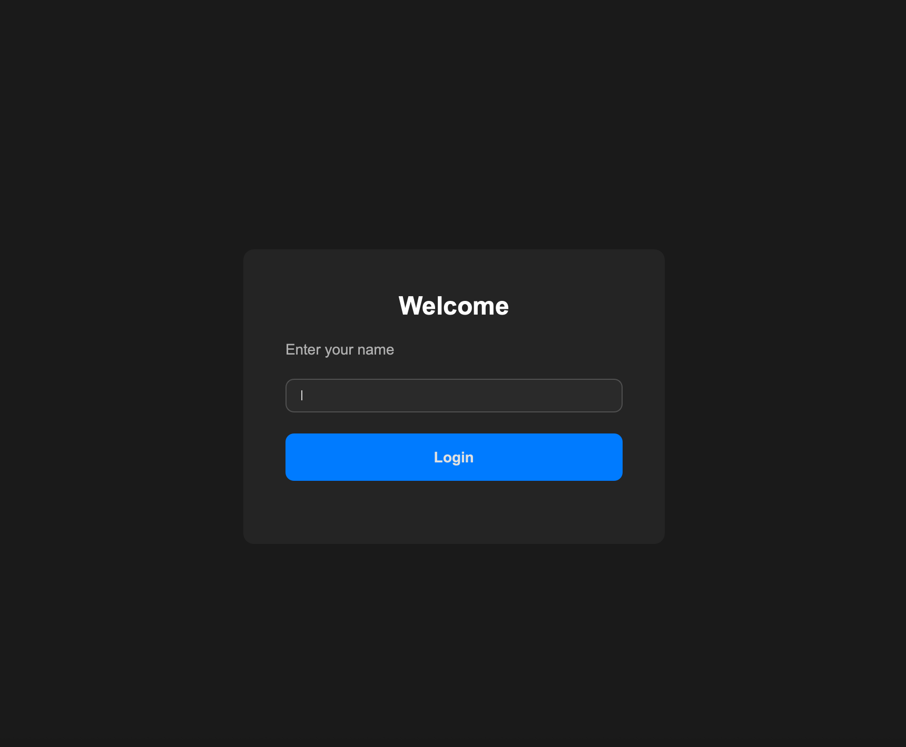
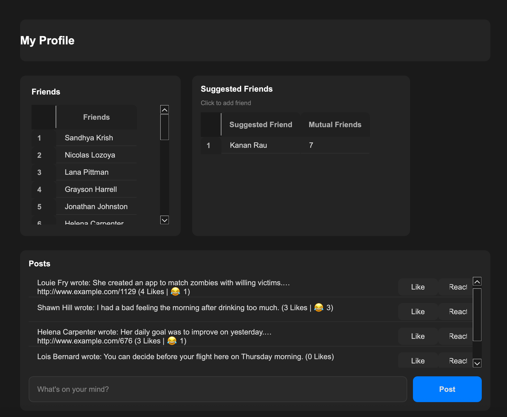
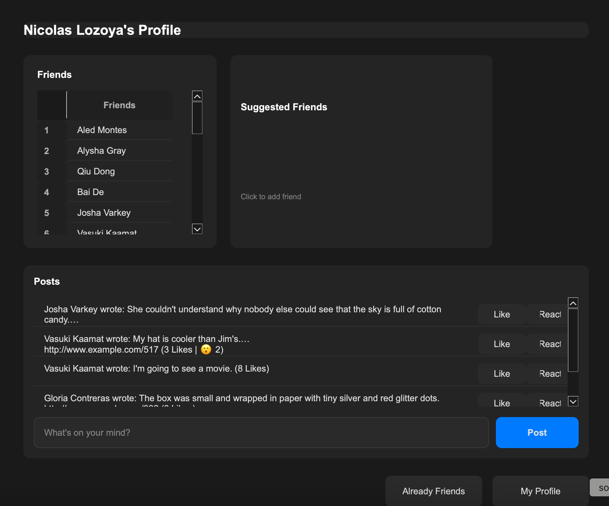

# Social Network
A full-featured social network application built with C++ and Qt Framework, implementing core social media functionality including user profiles, friendships, posts, and an interactive reaction system.

## Features

### User Management
- **User Authentication**: Simple login system with name-based authentication
- **Profile Pages**: View detailed user profiles with friends lists and recent posts
- **Friend Network**: Add and remove friend connections with mutual friend tracking
- **Friend Suggestions**: Intelligent friend recommendations based on mutual connections using graph algorithms

### Social Interactions
- **Post Creation**: Users can create text posts and link posts with URLs
- **Like System**: Like and unlike posts with real-time tracking of who liked each post
- **Reaction System**: React to posts with multiple emoji options (love, angry, crying, laughing, wow)
- **Reaction Management**: Change or remove reactions at any time, with one reaction per user per post

### Network Analysis
- **Shortest Path Finding**: Find the shortest connection path between any two users using BFS
- **Distance User Search**: Find users at a specific distance from a given user
- **Connected Components**: Identify groups of connected users within the network using DFS
- **Friend Suggestion Algorithm**: Rank potential friends by number of mutual connections

### User Interface
- **Multi-Page Navigation**: Seamless navigation between login, profile, and friend pages using QStackedWidget
- **Interactive Tables**: 
  - Friends list with click-to-navigate functionality
  - Friend suggestions with mutual friend counts
  - Posts table with inline like/react buttons
- **Dynamic Content**: Real-time UI updates when adding friends, posting, or reacting
- **Responsive Design**: Word-wrapped posts and auto-resizing table columns for optimal viewing

**Technical Skills: OOP, DSA, File IO, Memory Management, QT Framework and GUI Developement**
